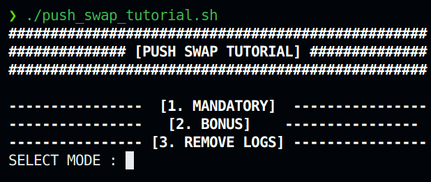

# Push_Swap_Auto_Checker

!

This is a simple to use checker for Push_Swap written in Shell.

## Usage

1. Download the script (or clone the repository)

    You can Download the script [**here**](https://github.com/yupab3/push_swap_auto_checker/blob/master/push_swap_tutorial.sh)

    or

    ```bash
   git clone https://github.com/yupab3/push_swap_auto_checker.git
    ```

2. Add the script into your project folder with your compiled Push_Swap
3. Change the permissions of the script to make it executable

    ```bash
   ./chmod +x push_swap_auto_checker.sh
    ```

4. Run the script and choose your option

    ```bash
   ./push_swap_auto_checker.sh
    ```

## Credits

- [Dongyeop Kim (yupab3)](https://github.com/yupab3) - Main Code
- [Vincent Wutthisit Brabandt (vbrabandt2005)](https://github.com/vbrabandt2005) - wrote the README
